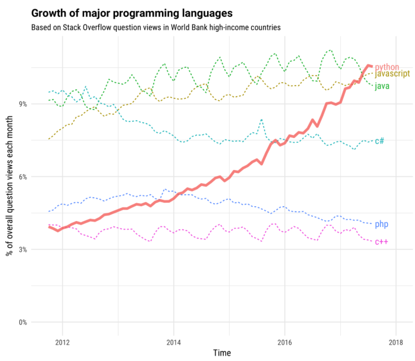
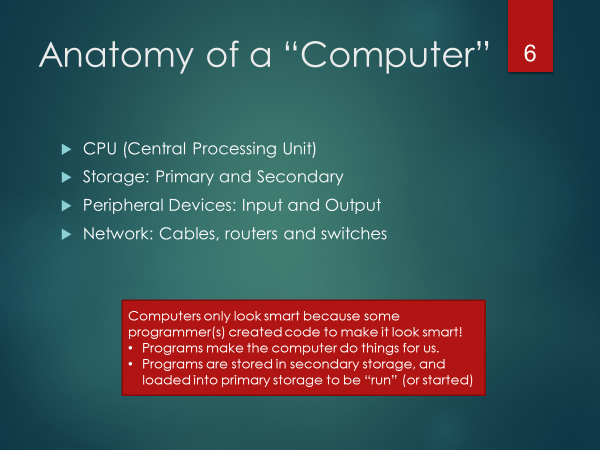
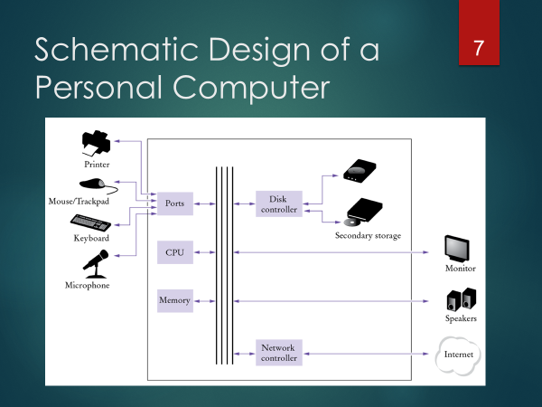
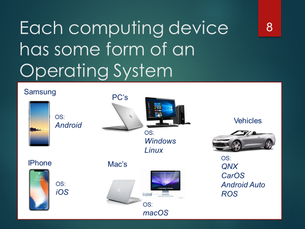
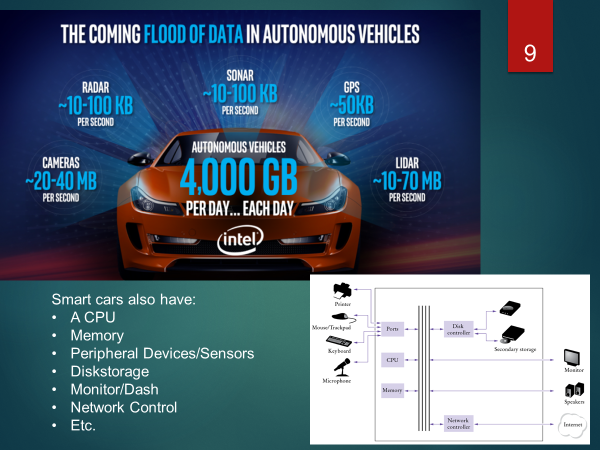
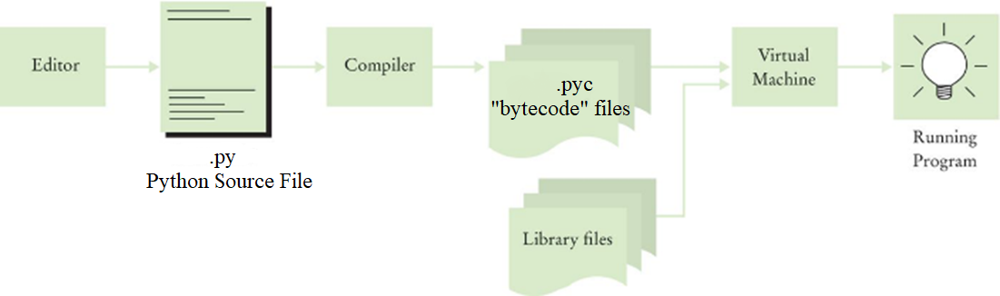
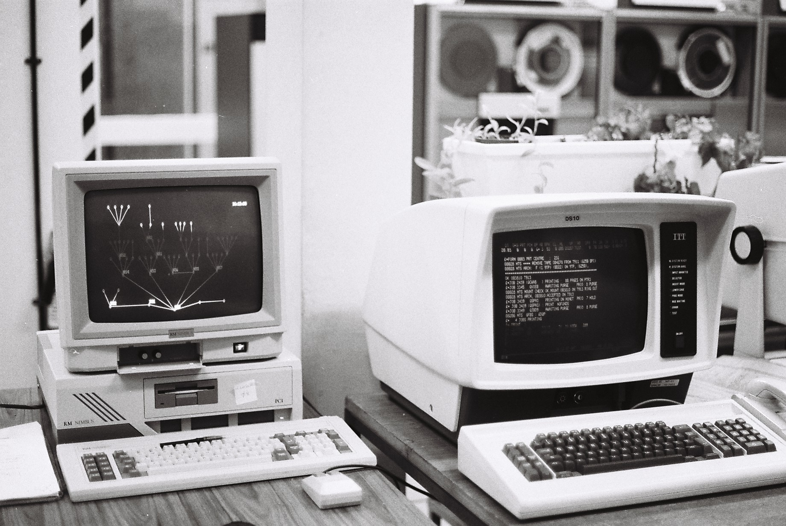
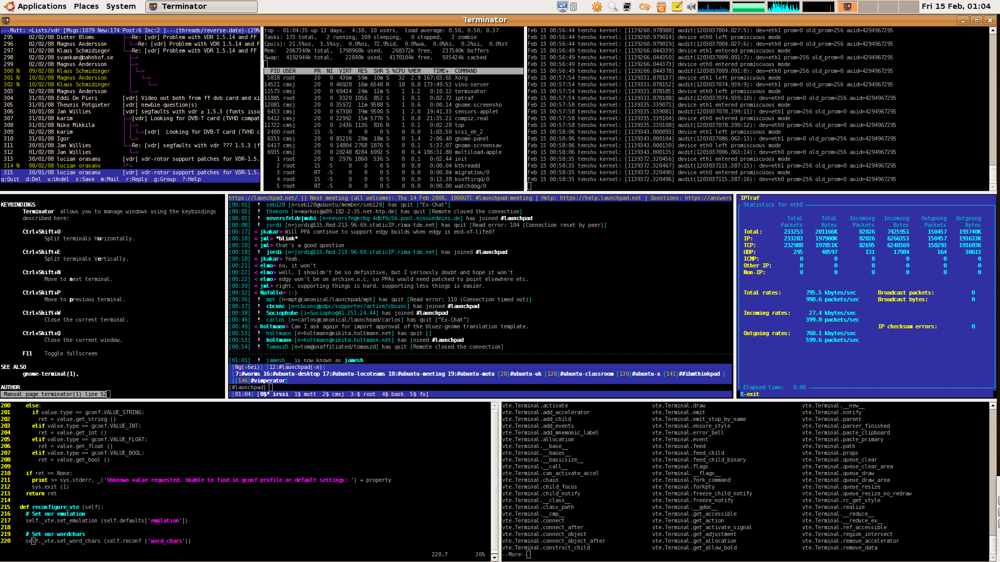

[TOC levels=4 numbered]: # "Class01"

- [Class01](#class01)
  - [Objectives](#objectives)
- [Accessing Course Content](#accessing-course-content)
- [Introduction to Programming (and Python)](#introduction-to-programming-and-python)
  - [What is a program?](#what-is-a-program)
  - [The Python Programming Language](#the-python-programming-language)
  - [Why learn Python?](#why-learn-python)
  - [More background on Python](#more-background-on-python)
  - [Python Enhancement Proposals (PEPs)](#python-enhancement-proposals-peps)
  - [Python Terms](#python-terms)
    - [Why do this? Don't be a Pakled.](#why-do-this-dont-be-a-pakled)
- [Getting to Know Your Computer](#getting-to-know-your-computer)
  - [What happens when you "run" a python program](#what-happens-when-you-%22run%22-a-python-program)
- [Introduction to the command line, terminal, and shell](#introduction-to-the-command-line-terminal-and-shell)
  - [Setting the historical context](#setting-the-historical-context)
    - [So, terminal or console?](#so-terminal-or-console)
    - [What about shells?](#what-about-shells)
    - [You will need to know the basics of the Bash shell](#you-will-need-to-know-the-basics-of-the-bash-shell)
    - [Resources for learning Bash.](#resources-for-learning-bash)
- [Exercise01](#exercise01)
- [For next class](#for-next-class)

# Class01

In this first class, I provide a (very) quick introduction to Python and computer programming, and then introduce command line interface and help students install the necessary software.

## Objectives

* Introduce Basic Computer Architecture and Command Line interface
* Provide an introduction to application development and the role of programming and programming languages.
* Introduce Command Line Interface
* Install Git
* Complete Assignment #1 
   
# Accessing Course Content

All content for this course is available via GitHub (https://github.com/ITM360). 

Within GitHub, I've created an organization for ITM360 programming for managers, and within this, a number of different "repos" (repositories - a term we will cover later) that will hold content for assignments, tests, and class notes. 

You will not be able to access all of this course content until you create your GitHub account and are invited to join the organization/class (this will be an exercise that you will do next class). For now, you should be able to access class01 content from here https://github.com/ITM360/ITM360-Public .

# Introduction to Programming (and Python)

## What is a program?

A program is a sequence of instructions to accomplish a task. A programming language is different than a "natural language" (i.e., English, French, Spanish); it's much more formal and meant to force the "speaker" of the language to be very specific. The "listener" of the language is the computer, and computers have difficulties with nuanced communication and thus require very detailed and accurate instructions on how to perform any task. NOTE: Computers only look smart because some programmer(s) make it look that way.

##  The Python Programming Language

The programming language you will be learning in this course is Python. There are many other languages out there. Some languages are general-purpose;  in that, they are meant to allow a programmer to create virtually any application, while others are more domain specific and focus on a subset of programs/application development (i.e., Mathematica, MatLab)

We classify Python as a "high-level" language. High-level languages are much easier to work with than low-level languages (such as assembler, and to some extent, C). Most programs are developed in high-level languages. Low-level languages are used to create programs that are "close to the machine" and involve things like creating device drivers, and specific applications to work with low-level features of a computer chip.

## Why learn Python?

There are literally [hundreds of programming languages](https://en.wikipedia.org/wiki/List_of_programming_languages) to choose from.

'Which language is more popular' is an often asked question. If you hear x language is the most popular, or y language has grown in use more than any other languages - such simple statements are often misguided. For instance, if you were working for a company that developed very low-level embedded systems (low-level programming) used by motherboard manufacturers, you'd look foolish proposing that the company switch it's language to Java (a high-level graphical programming language) because it was "more popular" than the current language the company was using (such as C, or assembler). So, when assessing what "the best language is," context matters.

That being said, in aggregate, Python is one of the [most popular programming languages](https://stackoverflow.blog/2017/09/06/incredible-growth-python/) used within "high income" countries (United States, United Kingdom, Germany, Canada, etc.).

Python is also particularly well suited for [data science, machine learning, and predictive analytics](https://stackoverflow.blog/2017/09/14/python-growing-quickly/) contexts - as well as Cybersecurity (ever watch Mr. Robot? When any code is shown, it's Python or Bash).

Python is one of the most accessible "professional level" languages to learn (by "professional level" I'm excluding languages that were developed purely for learning purposes, such as Alice).

Even if you don't plan to program, conduct data science/data analysis, or packet sniff or penetration test, etc. -- knowing a programming language may save your job, or help you get a new one.

This course will give you the necessary foundational knowledge of the language and tools so that you can more confidently access the many resources found on the internet to help you further develop your skills for whatever specialties you choose.

## More background on Python

Not named after the snake, but from Monty Python (The original creator of Python, Guido Van Rossum, was a big fan of Monty Python, and the Python documentation and community can reflect this and be a bit humorous/whimsical)

Python has a unique culture and community based on its core design philosophy on readability and syntax that enables you to write concise programs.

##  Python Enhancement Proposals (PEPs)

* Python language development is managed through PEP's
    * https://www.python.org/dev/peps/
* Examples:
    * PEP0 provides index to the PEPS
    * PEP1 states the purpose of PEPS
    * PEP8 provides a style guide for python code
* PEP20 -- is known as the Zen of Python
  * Design principles for Python code
  * 20 aphorisms, but only 19 have been written down
  * Accessible from Python Shell
  * (exec. 'import this' from inside shell)

## Python Terms

* Code that fits the philosophy of Python is called **Pythonic**.
    * Pythonic has many positive connotations
    * Unpythonic is a negative term 
* Python practitioners are called Pythonistas, Pythonists (or other play-on-words of Python)

Before we get into learning Python and programming, there is much for us to set up and understand.

In this course, you will be creating a workflow using tools such as Git, GitHub, and VSCode. These are the tools that a modern professional programmer will use. Git/GitHub skills are themselves especially new and in high demand.

In the following sections we'll get to know a bit more about your computer, learn about terminals, consoles, and shells, about version control systems (Git) and code sharing repositories (GitHub), about documentation using markdown, and working with our development.

### Why do this? Don't be a Pakled.

# Getting to Know Your Computer

## What happens when you "run" a python program

A programmer creates Python code using an editor (we will be using an Integrated Development Environment which contains an advanced Python editor).

The editor saves this code in a .py file.

The python interpreter compiles the .py  so that the code will run on the local machine/hardware. Though Python is often referred to an Interpreted language (versus a compiled language), Python does, in fact, compile the code into bytecode that then runs on a Python Virtual Machine. After running/using a python model you'll often see a .pyc file, this is Python storing the compiled code in a bytecode file to save time and run faster in the future. If the code changes the .pyc will be updated).

The .pyc file contains bytecode – this cannot be read by humans, nor directly by the computer hardware, it's meant only to be read by the Python virtual machine.

The Python virtual machine reads the .pyc file and "runs" the program by translating the bytecode to local instructions specific to the "machine" (computing device which the program is running on)

# Introduction to the command line, terminal, and shell

Any "power user" (of a computer) will know how to navigate and use the command prompt/terminal. In this course, you will need to develop basic terminal skills. To get started, let's look at the history of computers and where the interrelated terms "terminal," "shell," "console" and "command prompt" come from.

## Setting the historical context

In the image below we find a PC on the left, and one of many "dumb terminals" on the right.

Before the development of personal computers, computer systems were large and centralized. Access to these large "mainframe" (and later "mini") computers were generally through what were called "dumb" terminals. These terminals had very little to no processing power, and simply "knew" how to display text and read input that would be sent across a wire to the central computer. These terminals where physical extensions of the main computer. Many terminals were connected to the same computer.

Terminals were used by programmers and users to accomplish tasks. You might access via a user console, an operator console, or an administrator console. Each of these offered particular uses of the main computer. So, initially, the console was the physical terminal device that users used to access the computer.

With the advent of the PC, both the processing (mainframe) and the console (terminal) were merged into one personal device.

Initial PCs were not multi-tasking. There was only one user, using a single console, who would start and run one program at a time.

As PC's evolved, their operating systems became more sophisticated, and we began to see a duplication of the mainframe architecture; that is, a user could have multiple "terminals" (in this case, they would use software, not hardware) and run multiple programs.

### So, terminal or console?

For modern computers, should we see ways of accessing the computer as a terminal? Or a console?

As we see from the historical context of the mainframe world, in a sense, we could use these terms interchangeably. When I'm working as an admin, I may open an admin console. This would be done by running terminal software. Frankly, though, these terms are often used synonymously.

### What about shells?

Now, we have a third term that is often used synonymously with the other two, a "shell."

When computers began having software terminals, the user needed a "language" to communicate with the computer. The language we use is presented as a user shell... a wrapper, in a sense, or what has become known as a shell (program), that provides a user interface (through a language) to the system.

On Linux, and most flavors of Unix, the most common shell is BASH (Born Again Shell). This is also the shell used in MacOS (which is an extension of Unix). Another popular shell is zsh (z-shell) - used commonly by developers in MacOS.(but there are others as well)

Microsoft and the general "PC" market did not evolve from Unix, and therefore developed a different technical approach to creating a terminal, and communicating via a shell to the core computer. There's no need to get into great detail about this for this class, other than to associate what we've already covered with how Windows handles things. In windows, you run either "CMD" or "PowerShell" to get terminal access to the computer.

In windows, our terminal and shell is commonly called the "command prompt," "command terminal," or "command shell" (NOTE: A prompt is simply a curser that indicates that system is waiting for input). Most modern versions of windows (especially the server variety) have another type of terminal access, that referred to as "Powershell."

### You will need to know the basics of the Bash shell

In this course, we will review a few commands so that you can become familiar with the basic commands available in Bash (NOTE: With the installation of Git on a PC, a Bash shell is also installed). Bash shells behave pretty much the same as the Bash shells found on any Unix (i.e., Linux), MacOS system, and Windows. Though our primary focus though will be on learning Python, knowing Bash will allow you better control of your computer.

### Resources for learning Bash.

There are nine basic bash commands you should familiarize yourself with:
`"
pwd - Print Working Directory - Prints to the screen the directory your command prompt is current in. 
cd - Change Directory - changes the directory to one given
ls - List - list the contents of the current directory
cat - Concatenate - this displays the content of a file to the screen
cp - Copy - copies a given file to a given location
mv - Move - Moves a file from one location to another (often used to rename a file)
rm - Remove - Removes a file
rmdir - Remove Directory
mkdir - Make Directory
`"

To get help with any of these commands, simply add the command line switch --help. For instance, to get help on ls, type

`ls --help`

NOTE: Many of these commands have "switches", these are commands that are proceeded by one or two dashes (as you see with the help example above)

To run a program, you type the program name at the command prompt. For instance, if you wish to run a (non-compiled) version of a python program you're writing (which you've saved as hello.py), you would type the following.

`python hello.py`

Bash itself is also like a computer programming language. You will not be required to develop bash scripts in this course, but if you want to, you can quickly learn how to do such things. For a comprehensive introduction to the full "power" afforded by Bash, I'd suggest working through the examples found http://www.tldp.org/LDP/Bash-Beginners-Guide/html/Bash-Beginners-Guide.html, then here http://tldp.org/HOWTO/Bash-Prog-Intro-HOWTO.html and finally here http://www.tldp.org/LDP/abs/html/.

Also, there is a free course on Codeacademy (https://www.codecademy.com/learn/learn-the-command-line) that provides an excellent introduction to Bash.

# Exercise01

* Install Git (see git_install.md located in the ClassNotes/Class01 repository)
* Run bash (the professor will provide instructions on how to start a terminal/bash session)
* before starting the following commands, you will turn on logging so that every command you enter will be recorded. You will then submit this log file to Blackboard once you have completed.  (script ica01.log)
  * go to your home directory (`cd ~`)
  * go into your Documents directory (for Mac -> `cd Documents`, for Windows -> `cd "My Documents"`)
  * create a new folder called itm695 (`mkdir itm695`)
  * change directory into your new folder (`cd itm695`)
  * inside the itm695 folder, create a new folder call ex01-a (`mkdir ex01-a`)
  * change directory into this new folder (`cd ex01-a`)
    * NOTE: You can always test to see which directory you are in by running the command `pwd` (which stands for **p**rint **w**orking **d**irectory)
  * using the "echo" command (this is a bash command that simply echos the given test to the output) and output redirection to create a new file called "about.txt" that contains your first and name (`echo "FName LName" > about.txt`)
  * test to see that the file exists by listing the contents of the directory (`ls`)
  * display the content of the file to the screen to verify that you have correctly entered the data (`cat about.txt`)
  * now, move up one directory (`cd ..`)
  * Create a new directory called ex01-b (`mkdir ex01-b`)
  * Copy the content of `ex01-a` into `ex01-b` (`cp ex01-a ex01-b`)
  * remove the ex01-a directory (`rm -rf ex01-a`)
  * rename ex01-b to ex01 (`mv ex01-b ex01`)

Once you have completed the above steps, type the command "exit". Then log into Blackboard and submit the ica01.log file that will now exist in your document directory. 

NOTE: It is now expected that you have the basic ability to use a bash prompt to move files, copy files, create and remove directories, delete files, and understand how to redirect output to a file, and view the contents of a file. Getting comfortable with this may take a bit of practice. I'd encourage you to spend a bit of time trying these commands and coming up with your own scenarios to text and exercise your skills in this area. 

# For next class

Read the first chapter of the GitPro book found here https://git-scm.com/book/en/v2
